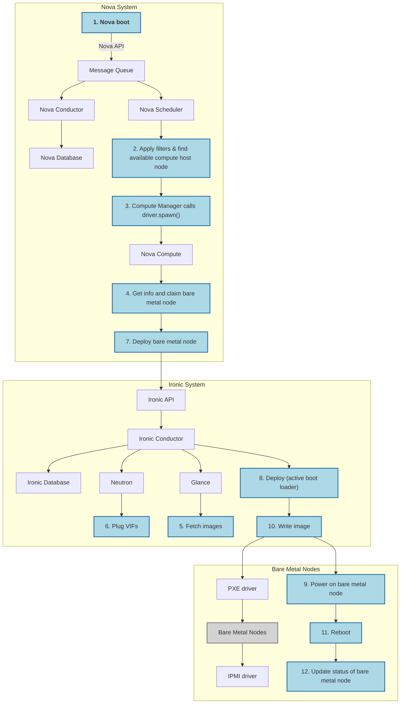

# go-redfish-uefi

## TFTP Auto Serve UEFI Rpi based on mac prefix

## DHCP Proxy - Serve http ipxe config files from remote sidero metal

## IPMI/Redfish API for changing RPI.fd firmware vars in TFTP dir and power state

Serve read/write TFTP server with rpi4 uefi firmware for each device. Add Redfish api endpoints for fw var modification.

Use go-uefi to patch firmware: <https://github.com/Foxboron/go-uefi>

Optional: Provide power on/off via unifi poe switch.

# DESIGN

TFTP should exist here

Power state should be web hook

# What is this project?

Provides a complete netboot environment using DHCP proxy, TFTP, Http, Ipxe, EDK2 among many other things.

This project supplies DHCP bootp responses for a raspberry PI's initial DHCP broadcast. TFTP returns edk2 for a second stage bootloader. The RPI then boots into the firmware. We can control the firmware with EFI vars using the embedded `virt-fw-vars`. This allows you to set the boot sequence etc.

If the bootloader netboots, the server will provide `snp.efi`, an IPXE binary from the Tinkerbell project that supports embedding scripts on the fly.

It is possible to provide the boot order via IPXE using the `sanboot` command.

This project provides a fully featured Redfish server to manage multiple Raspberry pis. The server iterates through DHCP leases and discovers which POE ports are attached to which MAC address. This allows for automatic power management with zero configuration.

The `virt-fw-vars` binary supports the `--set-boot-uri` parameter, which allows easy iso loading for Redfish.

## Requirements

Should contain method for power on and off + state

## Other Options

Deploy sidero metal
