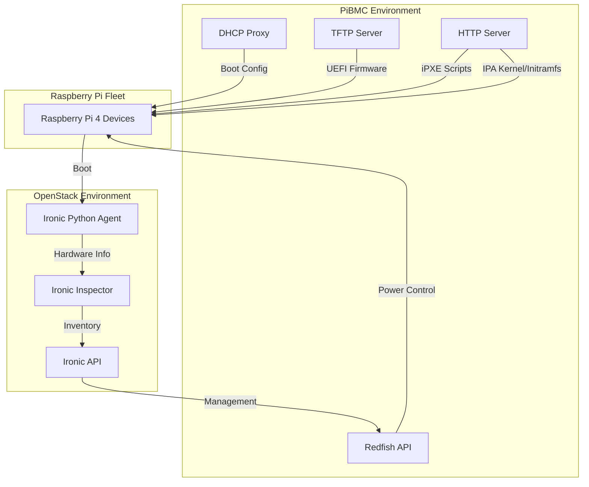

# PiBMC: Raspberry Pi Baseboard Management Controller

A complete netboot environment and management system for Raspberry Pi 4 devices using DHCP proxy, TFTP, HTTP, iPXE, EDK2, UEFI, and Redfish.

## Overview

PiBMC provides enterprise-grade server management capabilities for Raspberry Pi 4 devices by implementing:

1. Network booting through DHCP proxy and TFTP services
2. UEFI firmware customization for Raspberry Pi 4
3. Redfish-compatible API for hardware management
4. Power management via PoE switches
5. Remote console access

This project turns inexpensive Raspberry Pi 4 hardware into managed computing resources with functionality similar to enterprise-grade BMC (Baseboard Management Controller) solutions.

## Architecture


## Netbooting Raspberry Pi 4 Devices

### How Netbooting Works in PiBMC

PiBMC implements a comprehensive netboot process for Raspberry Pi 4 devices:


1. **Initial Boot Phase**:
   - The Raspberry Pi 4 sends a DHCP broadcast on the network
   - PiBMC's DHCP proxy service responds with appropriate options including TFTP server information
   - The Pi downloads and boots the UEFI firmware (RPI_EFI.fd) via TFTP

2. **UEFI Firmware Phase**:
   - The Pi boots into EDK2-based UEFI firmware
   - UEFI firmware reads its configuration and boot entries
   - Based on boot order, the Pi may attempt PXE boot

3. **iPXE Boot Phase**:
   - If netbooting, the Pi requests iPXE boot loader
   - The iPXE boot loader retrieves a dynamic boot script
   - The boot script configures kernel, initramfs and boot parameters
   - The Pi loads and boots the provided OS

### Configuring Netboot

Netboot configuration is managed through the `netboot.yaml` and `backend.yaml` files:

```yaml
e0:92:8f:45:b4:40:
  allow_pxe: true
  console: ""
  facility: ""
  ipxe_script: ""
  ipxe_script_url: null
  osie:
    kernel: ironic-python-agent.kernel
    initrd: ironic-python-agent.initramfs
```

The configuration lets you define per-device settings, including:

- Whether PXE boot is allowed
- Console settings
- Custom iPXE scripts
- Kernel and initramfs files

## UEFI Firmware Customization

PiBMC incorporates tools for modifying and managing UEFI firmware for Raspberry Pi 4 devices.

### EDK2 Firmware for Raspberry Pi

PiBMC uses the EDK2-based UEFI firmware for Raspberry Pi 4 (from [pftf/RPi4](https://github.com/pftf/RPi4)). The firmware is embedded in the application and served via TFTP.

Default UEFI configuration:

```
arm_64bit=1
arm_boost=1
enable_uart=1
uart_2ndstage=1
enable_gic=1
armstub=RPI_EFI.fd
disable_commandline_tags=1
disable_overscan=1
device_tree_address=0x1f0000
device_tree_end=0x200000
dtoverlay=miniuart-bt
dtoverlay=upstream-pi4
tftp_prefix=2
```

### Working with EFI Variables

PiBMC provides functionality to:

1. **Read** existing EFI variables from firmware
2. **Modify** EFI variables including boot entries
3. **Write** updated EFI variables back to firmware
4. **Serve** customized firmware to devices

#### Viewing and Modifying Boot Entries

EFI boot entries control the boot sequence of the Raspberry Pi. PiBMC can decode and modify these entries:

Example boot entry:

```
Boot0003: boot entry: title="UEFI PXEv4 (MAC:D83ADD5A440C)" devpath=MAC()/IPv4() optdata=4eac0881119f594d850ee21a522c59b2
```

Boot entries can be modified to change:

- Boot order (which devices are tried first)
- PXE boot configuration
- Network boot options
- MAC address binding

The `virt-fw-vars` tool is used to manipulate UEFI variables with commands like:

```bash
virt-fw-vars --inplace RPI_EFI.fd --set-json firmware-vars.json
```

## BMC Functionality

PiBMC implements industry-standard Redfish API for out-of-band management of Raspberry Pi devices.

### Redfish API

The Redfish API provides a RESTful interface for:

- Device discovery and inventory
- Hardware status monitoring
- Power control (on/off/restart)
- Boot configuration
- Firmware updates

### Power Management

PiBMC can control power to Raspberry Pi devices by:

1. **PoE Switch Control**: For Raspberry Pis powered via Power over Ethernet, PiBMC can control power by managing PoE switch ports.

```yaml
Power:
  device_id: f4:e2:c6:50:60:bb
  mode: "PowerOn"
  port: 2
  state: "on"
```

### Automated Device Discovery

PiBMC maintains a mapping between MAC addresses and PoE switch ports, allowing for automatic discovery and power management of Raspberry Pi devices on the network.

## Deployment Example

### Complete Setup with Ironic Inspection

PiBMC can integrate with OpenStack Ironic for complete bare-metal provisioning:



1. PiBMC provides DHCP, TFTP and HTTP services for netbooting
2. Raspberry Pi devices boot the Ironic Python Agent (IPA)
3. IPA collects hardware information and sends to Ironic Inspector
4. Ironic manages the devices through PiBMC's Redfish API

## Testing

### Local Testing Environment

To set up a local testing environment:

1. Configure a test network with a DHCP server that forwards PXE requests
2. Connect Raspberry Pi devices to this network
3. Run PiBMC server on a machine on the same network
4. Observe DHCP requests and responses using a network analyzer

### Testing UEFI Firmware Modifications

To test modifications to UEFI firmware:

1. Create a backup of existing firmware
2. Make changes to EFI variables using the provided tools
3. Serve the modified firmware to a test device
4. Verify boot behavior matches expectations

### Verification Checklist

- [ ] DHCP proxy correctly responds to PXE boot requests
- [ ] TFTP server successfully delivers firmware files
- [ ] UEFI firmware boots and honors variable settings
- [ ] iPXE boot loader successfully loads and runs
- [ ] Redfish API correctly reports device status
- [ ] Power control functions work as expected

## Contributing

Contributions to PiBMC are welcome! Here are some guidelines:

1. **Code Style**: Follow Go best practices and ensure code passes linting
2. **Testing**: Add unit tests for new functionality
3. **Documentation**: Update documentation for new features
4. **Pull Requests**: Create PRs with clear descriptions of changes
5. **Issues**: Use GitHub issues to report bugs or request features

### Setting Up Development Environment

```bash
# Clone the repository
git clone https://github.com/bmcpi/pibmc.git
cd pibmc

# Install dependencies
go mod download

# Build the project
go build ./cmd/pibmc
```

## License

[License details would go here]

## Requirements

- A network with DHCP and TFTP capabilities
- Raspberry Pi 4 devices with network boot enabled
- For power management: PoE switch with API access
- Go 1.18+ for development

## References

- [UEFI Firmware for Raspberry Pi 4](https://github.com/pftf/RPi4)
- [iPXE Boot Loader](https://ipxe.org/)
- [Redfish API Standard](https://www.dmtf.org/standards/redfish)
- [Ironic Python Agent](https://docs.openstack.org/ironic-python-agent/latest/)
