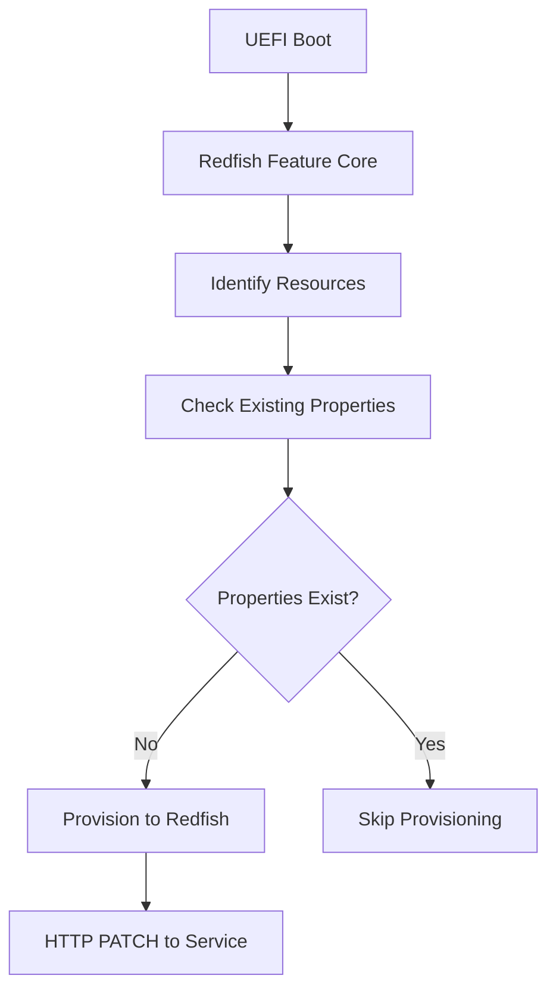
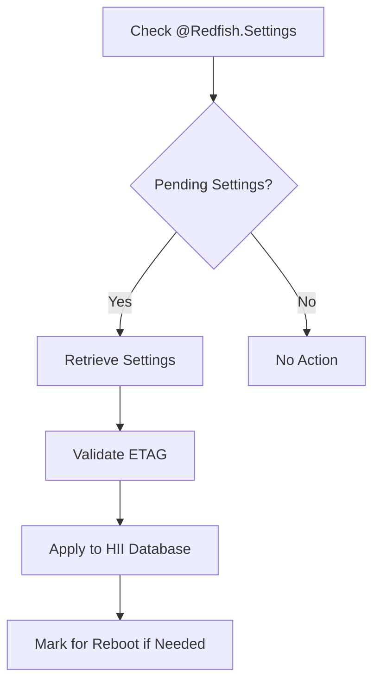

# Redfish Client Configuration for RPi4

## Overview

This document describes how to configure the UEFI Redfish client on the Raspberry Pi 4 to communicate with out-of-band Redfish servers and synchronize BIOS state with remote endpoints.

## Configuration Methods

The EDK2 Redfish implementation provides several configuration methods depending on your platform setup:

### 1. Static Configuration via EFI Variables (Emulator-Style)

This method is suitable for development and testing with the Redfish Profile Simulator.

#### Required EFI Variables

The following EFI variables control Redfish service connection parameters:

```c
// Service endpoint configuration
gEmuRedfishServiceGuid:
  - HostIpAssignmentType     (UINT8)  - 1=Static, 3=Auto
  - HostIpAddress           (IPv4)    - Local IP address  
  - HostIpMask              (IPv4)    - Local subnet mask
  - RedfishServiceIpAddress (IPv4)    - Remote Redfish server IP
  - RedfishServiceIpMask    (IPv4)    - Remote server subnet mask
  - RedfishServiceIpPort    (UINT16)  - Service port (typically 443/80)
```

#### Setting Variables via RedfishPlatformConfig.efi

The firmware includes a configuration utility accessible from the EFI Shell:

```bash
# Static IP configuration
RedfishPlatformConfig.efi -s <HostIP> <HostMask> <ServerIP> <ServerMask> <Port>

# Example: Configure for localhost simulator
RedfishPlatformConfig.efi -s 192.168.1.100 255.255.255.0 192.168.1.101 255.255.255.0 5000

# Auto IP configuration (DHCP-style)
RedfishPlatformConfig.efi -a <ServerIP> <ServerMask> <Port>

# Example: Auto configuration for simulator
RedfishPlatformConfig.efi -a 192.168.1.101 255.255.255.0 5000
```

### 2. BMC-Based Configuration via IPMI (Production)

For production environments with a Baseboard Management Controller (BMC), the Redfish client can automatically discover and configure service endpoints.

#### BMC USB NIC Configuration

The platform is configured to use `PlatformHostInterfaceBmcUsbNicLib` which:

1. **Discovers BMC-exposed USB NIC** via IPMI commands
2. **Retrieves network configuration** automatically from BMC
3. **Establishes credentials** via Redfish Credential Bootstrapping

Key IPMI commands used:

- `NetFn App (0x06) Command 0x42`: Verify 802.3 LAN/IPMB 1.0 channel
- `NetFn Transport (0x0C) Command 0x02`: Get MAC, IP, subnet, gateway, VLAN
- `NetFn Group Ext (0x2C) Command 0x52/0x02`: Bootstrap credentials

#### MAC/IP Address Rules for BMC USB NIC

The implementation follows these conventions:

- **Host MAC** = BMC MAC - 1 (e.g., BMC: `11:22:33:44:55:00`, Host: `11:22:33:44:55:ff`)
- **Host IP** = BMC IP - 1 (e.g., BMC: `169.254.0.10`, Host: `169.254.0.9`)

### 3. Network Device Path Configuration

For specific network interface targeting, configure the device path PCD:

```c
# In platform .dsc file:
gEfiRedfishPkgTokenSpaceGuid.PcdRedfishRestExServiceDevicePath.DevicePath|{DEVICE_PATH("MAC(000000000000,0x1)")}
```

Replace `000000000000` with the actual MAC address of your network interface.

## Credential Configuration

### Default Credentials (Development)

The current implementation uses hardcoded credentials via `RedfishPlatformCredentialLib`:

```c
// Default credentials for Redfish Profile Simulator
User ID: "root" 
Password: "root123456"
Authentication Method: HTTP Basic Auth
```

### Custom Credential Implementation

For production deployments, implement a custom `RedfishPlatformCredentialLib`:

```c
EFI_STATUS
GetRedfishCredential (
  OUT EDKII_REDFISH_AUTH_METHOD  *AuthMethod,
  OUT CHAR8                      **UserId,
  OUT CHAR8                      **Password
  )
{
  // Implement platform-specific credential retrieval
  // Options:
  //   - Secure storage (TPM, secure NVRAM)
  //   - Certificate-based authentication
  //   - OAuth tokens
  //   - IPMI credential bootstrapping
  
  *AuthMethod = AuthMethodHttpBasic; // or AuthMethodRedfishSession
  // Populate UserId and Password from secure source
  return EFI_SUCCESS;
}
```

## BIOS State Synchronization

### Configuration Language Mapping

The Redfish client uses x-UEFI-redfish Configure Language to map HII options to Redfish properties:

```c
// Example mappings in .uni files
#string STR_BOOT_SOURCE_OVERRIDE_ENABLED_PROMPT  #language x-UEFI-redfish-ComputerSystem.v1_0_0  "/Boot/BootSourceOverrideEnabled"
#string STR_BOOT_SOURCE_OVERRIDE_MODE_PROMPT     #language x-UEFI-redfish-ComputerSystem.v1_0_0  "/Boot/BootSourceOverrideMode"
#string STR_BOOT_SOURCE_OVERRIDE_TARGET_PROMPT   #language x-UEFI-redfish-ComputerSystem.v1_0_0  "/Boot/BootSourceOverrideTarget"
```

### Synchronization Process

The synchronization occurs in several phases:

1. **Provisioning**: BIOS settings → Redfish service (first boot)
2. **Consuming**: Redfish service → BIOS settings (applying changes)
3. **Updating**: BIOS changes → Redfish service (reflecting local changes)

#### Provisioning Flow



#### Consuming Flow



### Service Requirements

For proper synchronization, the Redfish service must support:

1. **HTTP PATCH Operations**: For property updates
2. **@Redfish.Settings Annotation**: For pending settings
3. **ETAG Support**: For change detection and caching
4. **Bootstrap Account**: For BIOS write permissions

Example service response with pending settings:

```json
{
  "@odata.type": "#ComputerSystem.v1_0_0.ComputerSystem",
  "@odata.id": "/redfish/v1/Systems/system",
  "Boot": {
    "BootSourceOverrideEnabled": "Once",
    "BootSourceOverrideTarget": "Pxe"
  },
  "@Redfish.Settings": {
    "@odata.type": "#Settings.v1_3_3.Settings",
    "SettingsObject": {
      "@odata.id": "/redfish/v1/Systems/system",
      "@odata.etag": "W/\"ABCDEFG\"",
      "Boot": {
        "BootSourceOverrideTarget": "Hdd"
      }
    }
  }
}
```

## Testing and Validation

### Using the Redfish Profile Simulator

1. **Start the simulator**:

   ```bash
   cd testing
   ./setup-redfish-simulator.sh
   cd redfish-simulator
   ./start-rpi4-simulator.sh
   ```

2. **Configure the firmware**:

   ```bash
   # Boot to EFI Shell and run:
   RedfishPlatformConfig.efi -a 127.0.0.1 255.255.255.0 5000
   ```

3. **Test connectivity**:

   ```bash
   # From host system:
   curl -u root:root123456 http://localhost:5000/redfish/v1/Systems/system/
   ```

### Validation Checklist

- [ ] Service root accessible (`/redfish/v1/`)
- [ ] Systems collection present (`/redfish/v1/Systems/`)
- [ ] System instance configured (`/redfish/v1/Systems/system/`)
- [ ] BIOS resource available (`/redfish/v1/Systems/system/Bios/`)
- [ ] Boot settings synchronize properly
- [ ] Pending settings are consumed on reboot
- [ ] ETAG headers are handled correctly

### Network Configuration Requirements

Ensure the following network settings are configured:

```c
// In platform .dsc file, enable:
NETWORK_SNP_ENABLE = TRUE
NETWORK_HTTP_ENABLE = TRUE  
NETWORK_ALLOW_HTTP_CONNECTIONS = TRUE  // For simulator testing
SECURE_BOOT_ENABLE = TRUE
REDFISH_ENABLE = TRUE
```

## Production Deployment

### Security Considerations

1. **Use HTTPS**: Configure `NETWORK_TLS_ENABLE = TRUE` and disable HTTP
2. **Certificate validation**: Implement proper certificate chains
3. **Secure credentials**: Use TPM or secure NVRAM for credential storage
4. **Network isolation**: Use dedicated management networks
5. **Access control**: Implement proper RBAC on Redfish service

### Platform-Specific Libraries

For production deployment, consider implementing:

- **Custom RedfishPlatformCredentialLib**: Secure credential management
- **Custom RedfishPlatformHostInterfaceLib**: Platform-specific discovery
- **Custom RedfishResourceIdentifyLib**: Resource identification policy
- **Custom RedfishResourceAddendumLib**: OEM-specific extensions

### Configuration Parameters

Key PCDs for production tuning:

```c
// Content encoding support
gEfiRedfishPkgTokenSpaceGuid.PcdRedfishServiceContentEncoding|"gzip"

// ETAG support configuration  
gEfiRedfishClientPkgTokenSpaceGuid.PcdRedfishServiceEtagSupported|TRUE

// Reboot requirement handling
gEfiRedfishClientPkgTokenSpaceGuid.PcdRedfishSystemRebootRequired|TRUE

// Feature driver startup event
PcdEdkIIRedfishFeatureDriverStartupEventGuid|gEfiEventReadyToBootGuid
```

## Troubleshooting

### Common Issues

1. **Network connectivity**: Verify physical network and IP configuration
2. **Authentication failures**: Check credentials and service accounts
3. **Schema mismatches**: Ensure compatible Redfish versions
4. **ETAG conflicts**: Verify ETAG support in service implementation
5. **Reboot loops**: Check PcdRedfishSystemRebootRequired setting

### Debug Information

Enable debug output with:

```c
DEBUG_PRINT_ERROR_LEVEL = 0x8000004F
```

Monitor Redfish-specific debug categories:

- `DEBUG_MANAGEABILITY`: General Redfish operations
- `DEBUG_ERROR`: Error conditions
- `DEBUG_INFO`: Informational messages

### Log Analysis

Key log entries to monitor:

- Service discovery completion
- Credential authentication success/failure  
- Resource provisioning operations
- Settings consumption events
- Network transport errors

For additional support, refer to the [EDK2 Redfish documentation](https://github.com/tianocore/edk2/blob/master/RedfishPkg/Readme.md) and [DMTF Redfish specifications](https://www.dmtf.org/standards/redfish).
